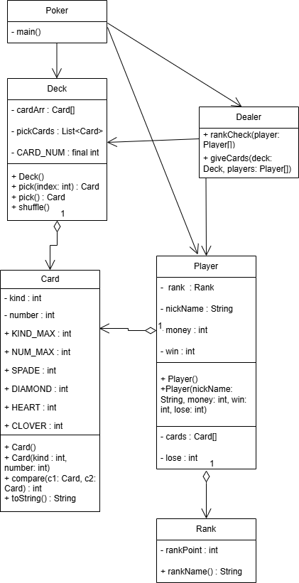
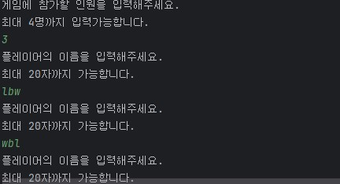
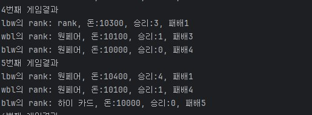
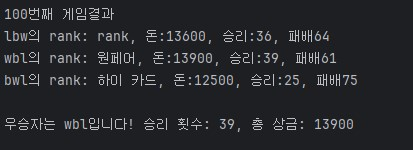

Poker

**Java**로 구현한 포커 게임입니다. 방식은 플레이어들이 카드를 5장씩 받고 그 카드에서 랭크기준에 맞게 더 높은 랭크를 얻은 플레이어가 이기는 게임입니다.

기능

- 딜러가 플레이어들에게 5장의 카드를 분배 및 랭크에 맞게 승패 결정
- 게임 진행 시 플레이어의 승/패 기록 및 돈 관리
- 최대 4명까지 참여 가능, 각각의 플레이어는 이름을 가지는데 20자를 넘지 못 함

클래스 설명

- 'Deck' Class : 카드를 관리하는 Class. 52장의 카드를 가지고 있고, 카드를 무작위로 섞고 선택하는 기능
- 'Card' Class : 카드의 속성(무늬, 숫자)를 정의
- 'Player' Class : 플레이어의 정보를 저장, 각각의 플레이어의 카드를 관리
-  'Delar' Class : 각각의 플레이어들에게 카드 분배 및 랭크 결정 후 승/패 계산담당
-  'Rank' Class : 각 플레이어들의 카드에 따른 랭크 관리, 승자 결정하는 기준 담당
  

다이어그램

실행화면

- 게임에 참여할 인원을 입력(최대 4명까지 가능)
- 각각의 플레이어의 이름을 입력(최대 20자까지 가능)

  

- 게임 진행 될 때마다 플레이어의 랭크, 승/패횟수 및 상금 출력

- 게임완료시 우승자 출력

  
